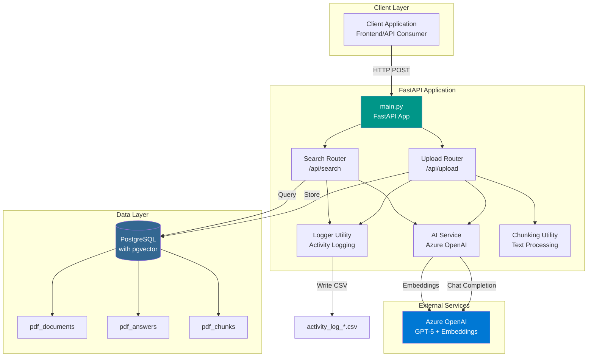
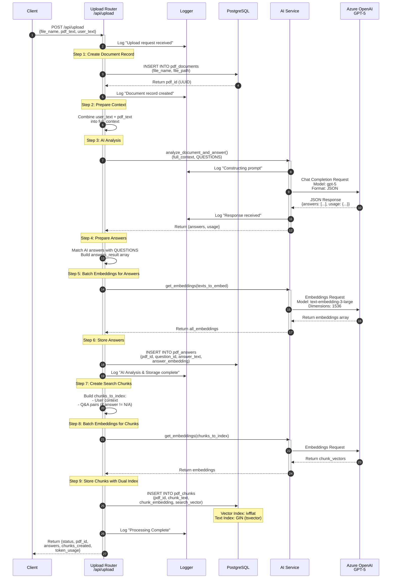
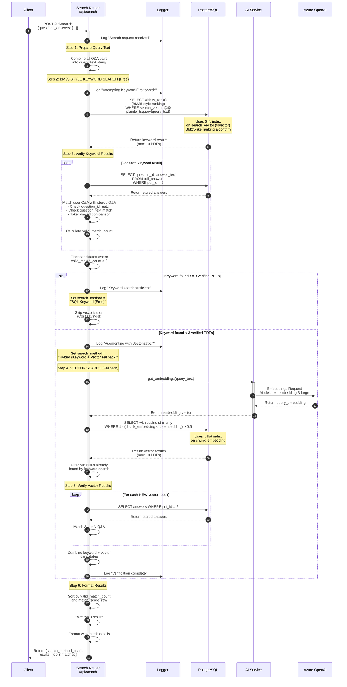
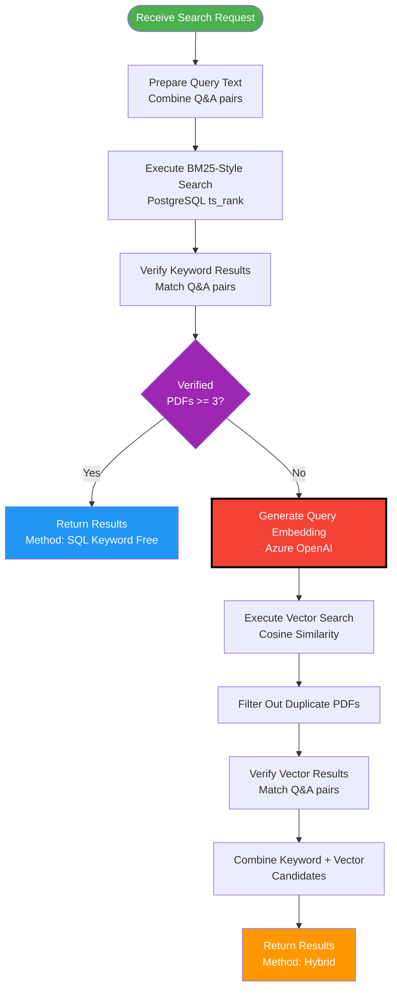
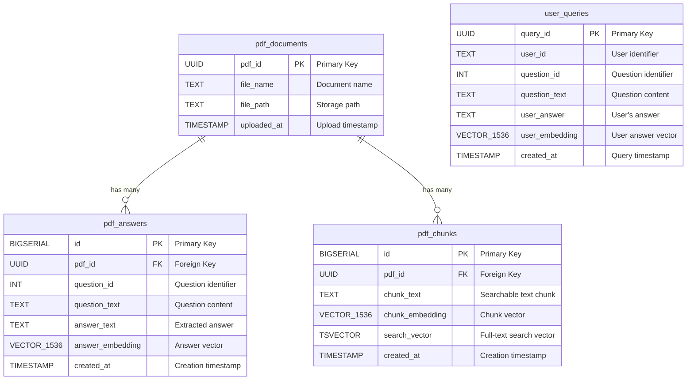
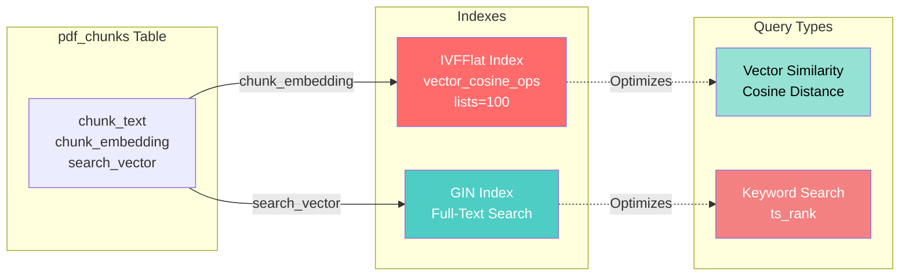
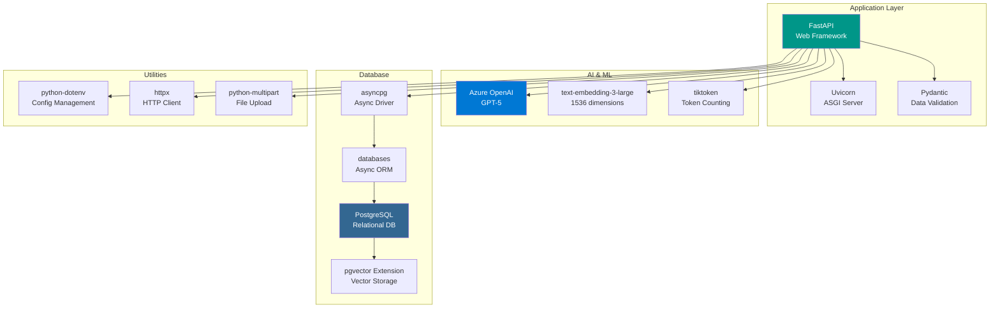
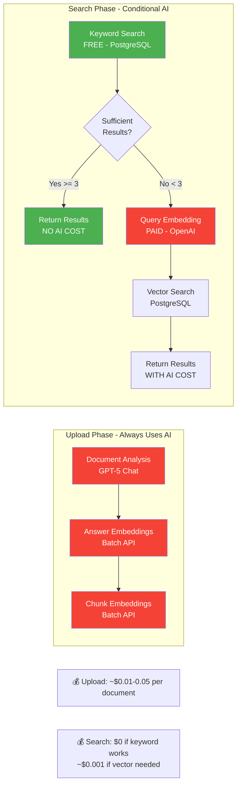
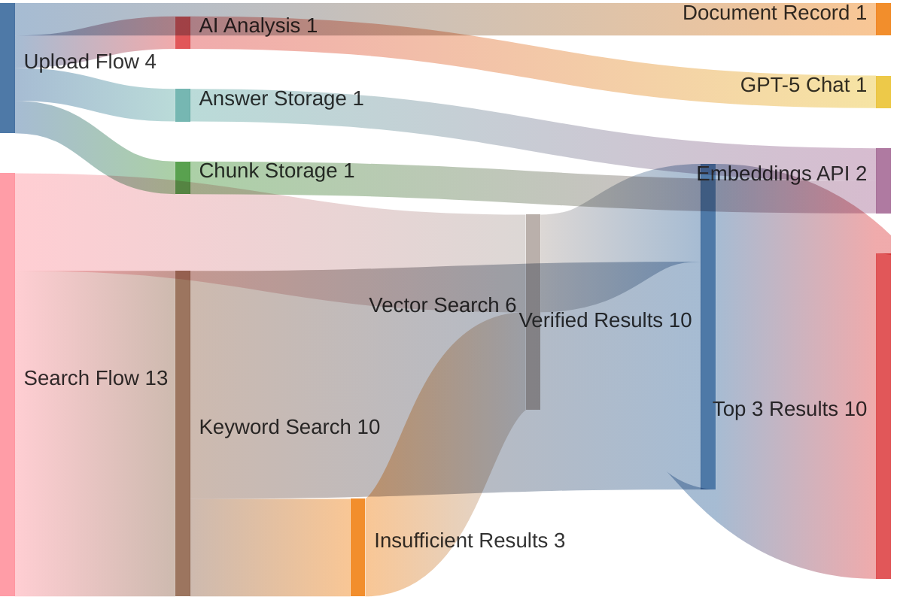

# COI Management Matching Engine - Technical Architecture

## System Overview

This document provides comprehensive technical diagrams for the COI Management Matching Engine, a FastAPI-based application that uses hybrid search (BM25-style keyword + vector similarity) with Azure OpenAI for document analysis and matching.

### AI Models Used
- **GPT-5** (Azure OpenAI) - Document analysis and Q&A extraction
- **text-embedding-3-large** (Azure OpenAI) - 1536-dimensional embeddings for semantic search

### Search Algorithms
- **BM25-style Ranking** - PostgreSQL's `ts_rank()` function for keyword search (similar to BM25)
- **Cosine Similarity** - Vector distance calculation for semantic search

---

## 1. System Architecture Overview



---

## 2. Search Algorithms Explained

### BM25-Style Keyword Search (PostgreSQL ts_rank)

**What is BM25?**
BM25 (Best Matching 25) is a probabilistic ranking function used for keyword-based search. It ranks documents based on term frequency and inverse document frequency.

**Our Implementation:**
We use PostgreSQL's `ts_rank()` function which provides similar functionality to BM25:
- **Term Frequency (TF)**: How often query terms appear in the document
- **Document Length Normalization**: Adjusts for document size
- **Inverse Document Frequency (IDF)**: Rare terms weighted more heavily

**SQL Query:**
```sql
SELECT ts_rank(search_vector, plainto_tsquery('english', query_text)) as rank
FROM pdf_chunks
WHERE search_vector @@ plainto_tsquery('english', query_text)
ORDER BY rank DESC
```

**Advantages:**
- ✅ **FREE** - No API costs
- ✅ **Fast** - Uses GIN index
- ✅ **Accurate** for exact keyword matches

### Vector Similarity Search (Cosine Distance)

**What is Cosine Similarity?**
Measures the angle between two vectors in high-dimensional space (1536 dimensions in our case).

**Our Implementation:**
```sql
SELECT 1 - (chunk_embedding <=> query_embedding) as similarity
FROM pdf_chunks
WHERE 1 - (chunk_embedding <=> query_embedding) > 0.5
ORDER BY similarity DESC
```

**Advantages:**
- ✅ **Semantic understanding** - Finds conceptually similar content
- ✅ **Handles synonyms** - "CEO" matches "Chief Executive Officer"
- ❌ **Costs money** - Requires OpenAI embedding API call

---

## 3. FastAPI Endpoint 1: Document Upload & Ingestion

**Endpoint**: `POST /api/upload`

**Purpose**: Process documents, extract Q&A using GPT-5, generate embeddings, and store in database with dual indexing.

**AI Models Used**:
- **GPT-5** - Forensic document analysis and answer extraction
- **text-embedding-3-large** - Generate 1536-dim vectors for answers and chunks

### 3.1 Upload Endpoint Architecture

```mermaid
graph TB
    subgraph "Client Request"
        CLIENT[POST /api/upload<br/>{file_name, pdf_text, user_text}]
    end
    
    subgraph "Upload Router Processing"
        RECEIVE[1. Receive Request]
        CREATE_DOC[2. Create Document Record]
        COMBINE[3. Combine Context]
        AI_ANALYZE[4. AI Analysis<br/>GPT-5]
        MATCH[5. Match Answers]
        EMBED_ANS[6. Embed Answers<br/>text-embedding-3-large]
        STORE_ANS[7. Store Answers]
        CREATE_CHUNKS[8. Create Chunks]
        EMBED_CHUNKS[9. Embed Chunks<br/>text-embedding-3-large]
        STORE_CHUNKS[10. Store Chunks]
    end
    
    subgraph "Database Tables"
        PDF_DOCS[(pdf_documents)]
        PDF_ANS[(pdf_answers<br/>with embeddings)]
        PDF_CHUNKS[(pdf_chunks<br/>dual indexed)]
    end
    
    subgraph "External AI"
        GPT5[Azure OpenAI<br/>GPT-5]
        EMBED_MODEL[Azure OpenAI<br/>text-embedding-3-large]
    end
    
    CLIENT --> RECEIVE
    RECEIVE --> CREATE_DOC
    CREATE_DOC --> PDF_DOCS
    CREATE_DOC --> COMBINE
    COMBINE --> AI_ANALYZE
    AI_ANALYZE --> GPT5
    GPT5 --> MATCH
    MATCH --> EMBED_ANS
    EMBED_ANS --> EMBED_MODEL
    EMBED_MODEL --> STORE_ANS
    STORE_ANS --> PDF_ANS
    STORE_ANS --> CREATE_CHUNKS
    CREATE_CHUNKS --> EMBED_CHUNKS
    EMBED_CHUNKS --> EMBED_MODEL
    EMBED_MODEL --> STORE_CHUNKS
    STORE_CHUNKS --> PDF_CHUNKS
    
    style GPT5 fill:#0078D4,color:#fff
    style EMBED_MODEL fill:#0078D4,color:#fff
    style PDF_DOCS fill:#336791,color:#fff
    style PDF_ANS fill:#336791,color:#fff
    style PDF_CHUNKS fill:#336791,color:#fff
    style CLIENT fill:#4CAF50,color:#fff
```

### 3.2 Upload Flow Diagram



### Upload Flow - Detailed Steps

| Step | Component | Action | Database Impact |
|------|-----------|--------|-----------------|
| 1 | Upload Router | Receive document data | - |
| 2 | Database | Create document record | INSERT `pdf_documents` |
| 3 | AI Service | Analyze document with GPT-5 | - |
| 4 | Upload Router | Process AI responses | - |
| 5 | AI Service | Generate answer embeddings | - |
| 6 | Database | Store answers with vectors | INSERT `pdf_answers` |
| 7 | Upload Router | Create searchable chunks | - |
| 8 | AI Service | Generate chunk embeddings | - |
| 9 | Database | Store chunks with dual index | INSERT `pdf_chunks` |

---

## 3. FastAPI Endpoint 2: Hybrid Search

**Endpoint**: `POST /api/search`

**Purpose**: Find matching documents using cost-optimized hybrid search (BM25-style keyword-first, vector fallback).

**Search Algorithms**:
- **Primary**: PostgreSQL `ts_rank()` - BM25-style keyword ranking (FREE)
- **Fallback**: Cosine similarity on embeddings (requires OpenAI API call)

**AI Models Used** (conditional):
- **text-embedding-3-large** - Generate query embedding (only if keyword search insufficient)

### 3.1 Search Flow Diagram



### Search Strategy Decision Tree



---

## 4. Database Schema



### Database Indexes



---

## 5. Technology Stack



---

## 6. API Endpoints

### Upload Endpoint

**POST** `/api/upload`

**Request Body:**
```json
{
  "file_name": "document.pdf",
  "pdf_text": "Full document content...",
  "user_text": "Additional context or instructions"
}
```

**Response:**
```json
{
  "status": "success",
  "pdf_id": "uuid-here",
  "extracted_text_preview": "First 200 chars...",
  "answers": [
    {
      "question_id": 1,
      "question_text": "What is...",
      "answer_text": "Extracted answer"
    }
  ],
  "chunks_created": 15,
  "token_usage": {
    "prompt_tokens": 1500,
    "completion_tokens": 300,
    "total_tokens": 1800
  }
}
```

### Search Endpoint

**POST** `/api/search`

**Request Body:**
```json
{
  "questions_answers": [
    {
      "question_id": 1,
      "question_text": "What is...",
      "answer_text": "User's answer"
    }
  ]
}
```

**Response:**
```json
{
  "search_method_used": "SQL Keyword (Free)",
  "results": [
    {
      "pdf_name": "document.pdf",
      "match_score": "85.5%",
      "search_method": "SQL Keyword (Free)",
      "relevance_details": {
        "vector": 0.855,
        "keyword_rank": 0.234
      },
      "matched_qa": [
        {
          "question": "What is...",
          "pdf_answer": "Stored answer",
          "user_answer_ref": "User's answer"
        }
      ],
      "unmatched_qa": []
    }
  ]
}
```

---

## 7. Cost Optimization Strategy



### Cost Breakdown

| Operation | Model | Cost Factor | Optimization |
|-----------|-------|-------------|--------------|
| Document Analysis | GPT-5 | High | Batch questions in single call |
| Answer Embeddings | text-embedding-3-large | Medium | Batch API (multiple texts at once) |
| Chunk Embeddings | text-embedding-3-large | Medium | Batch API |
| BM25-Style Keyword Search | PostgreSQL ts_rank | **FREE** | Primary search method |
| Vector Search | PostgreSQL + OpenAI | Low | Only when keyword insufficient |

---

## 8. Data Flow Summary



---

## Key Design Decisions

1. **Hybrid Search Strategy**: Keyword-first approach minimizes AI costs while maintaining accuracy
2. **Batch Embeddings**: All embeddings generated in batch calls for efficiency
3. **Dual Indexing**: Both vector (ivfflat) and text (GIN) indexes on chunks table
4. **Verification Layer**: All search results verified by matching Q&A pairs, not just similarity scores
5. **Structured Chunks**: Only Q&A pairs and context indexed, not raw document text
6. **Token-Based Matching**: Lenient matching algorithm for Q&A verification
7. **Activity Logging**: All operations logged to CSV for audit trail

---

## Performance Characteristics

- **Upload Latency**: 2-5 seconds (depends on document size and question count)
- **Search Latency**: 
  - Keyword-only: 100-300ms
  - Hybrid: 500-1000ms
- **Database**: PostgreSQL with pgvector extension
- **Scalability**: Horizontal scaling via multiple Uvicorn workers
- **Concurrency**: Async/await throughout for non-blocking I/O
